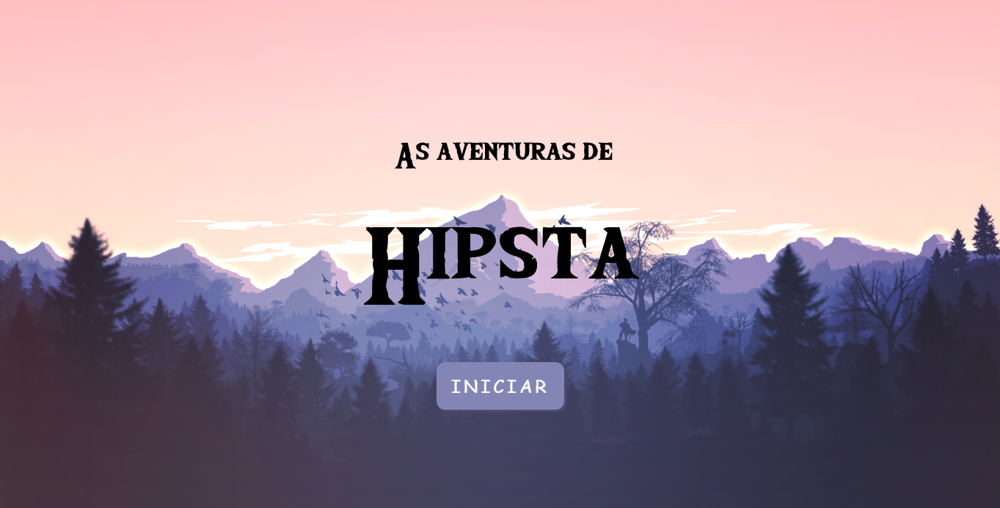
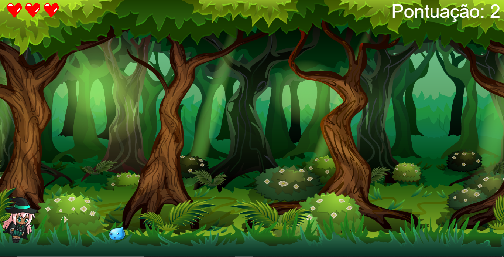
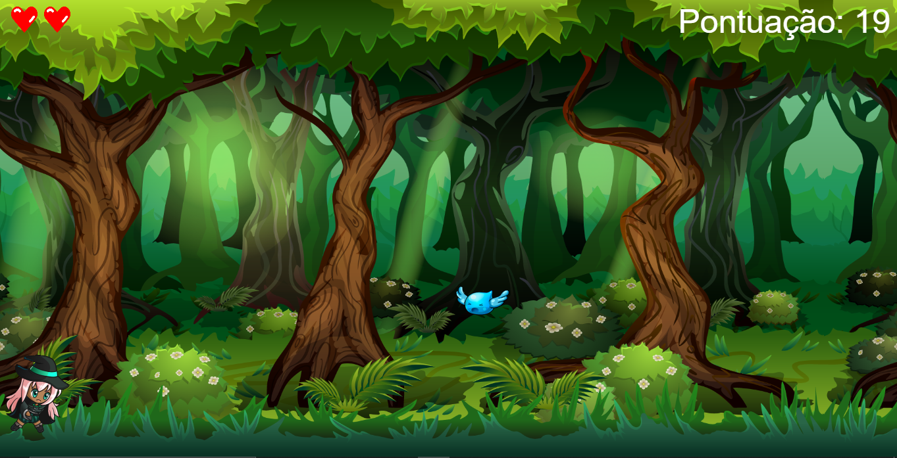

# Jogo

<h3>Desenvolvido utilizando p5.js durante a Imersão Game Dev da Alura</h3>

<br>

<div align="center" style="margin-top: 15px;">
  
</div>

<br>

<div align="center" style="margin-top: 15px;">
  
</div>

<br>

<div align="center" style="margin-top: 15px;">
  
</div>

<br>

<div align="center" style="margin-top: 15px;">
  
</div>

<br>

<div align="center" style="margin-top: 15px;">
  
</div>

<br>
<br>

## Project setup
```
yarn install
```

### Compiles and hot-reloads for development
```
yarn serve
```

### Compiles and minifies for production
```
yarn build
```

### Lints and fixes files
```
yarn lint
```

### Customize configuration
See [Configuration Reference](https://cli.vuejs.org/config/).
